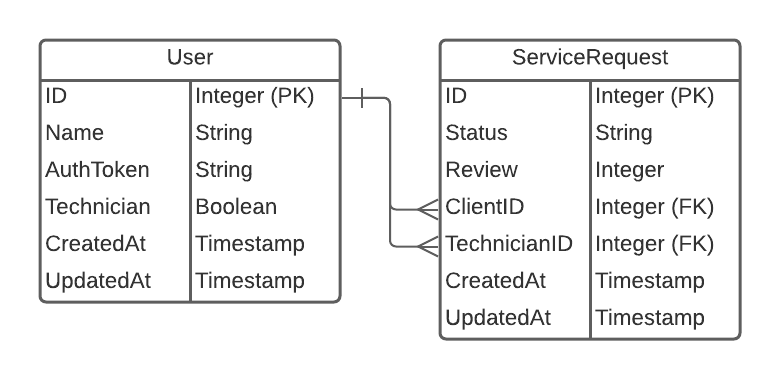

# Sistema de Órdenes de Servicio
## Sumario
- [Introducción](##introducción)
- [Objetivos Alcanzados](##objetivos-alcanzados)
- [Como Utilizar la API](##como-utilizar-la-api)
  - [Requerimientos Mínimos](###requerimientos-mínimos)
  - [Instalación](###instalación)
  - [Utilización](###utilización)
  - [Rutina Sugerida](###rutina-sugerida)
- [Autor](##autor)
- [Documentación](#documentación)
  - [Visión General de la Base de Datos](##visión-general-de-la-base-de-datos)
  - [Mutaciónes](##mutaciones)
    - [CreateUser](###createuser)
    - [DestroyUser](###destroyuser)
    - [CreateServiceRequest](###createservicerequest)
    - [UpdateServiceRequest](###updateservicerequest)
  - [Queries](##queries)
    - [serviceRequest](###servicerequest)
    - [serviceRequests](###servicerequests)
  -[Errores Possibles](##errores-possibles)

## Introducción

API desarrollada para administrar requerimientos de servicio técnico. A través de ella, se puede requerir nuevo servicio, actualizar su status y calificar el servicio.

## Objetivos Alcanzados
- Registro de clientes y técnicos con generación de token de autenticación utilizado en todos las acciones de la API.
- Creacción de requerimientos de servicio limitada a los clientes.
- Clientes y técnicos pueden obter informaciones individuales o en lista de los requerimientos vinculados a ellos.
- Actualización del status del requerimiento limitada al técnico responsable.
- Calificación del servicio prestado limitada al cliente que lo requirió y solamente puede ser hecha después que el técnico informó la prestación del servicio.

## Como Utilizar la API
### Requerimientos Mínimos
- Go 1.15
- PostgreSQL 12.3
- github.com/graphql-go/graphql v0.7.9
- github.com/graphql-go/handler v0.2.3
- github.com/jinzhu/gorm v1.9.16
- github.com/joho/godotenv v1.3.0


### Instalación
1 - A través de tu terminal, acceda a la carpeta donde deseas guardar este proyecto y ejecute el seguiente comando:

```
git clone git@github.com:luis-novoa/go-service-requests.git
```
2 - Crea en PostgreSQL la base de datos del proyectos (nombre sugerido: `service_request_db`) y el role que la administrará (nombre sugerido: `sr_role`). 
3 - Acceda a la carpeta del proyecto y cambie las informaciones del archivo `RENAME_THIS_FILE`. Debes fornecer el nombre del role en `DB_ROLE`, su contraseña en `DB_PASSWORD` y el nombre de la base de datos en `DB_NAME`.
4 - Cambie el nombre del archivo `RENAME_THIS_FILE` para `.env`.

### Utilización

1 - Inicie el servidor con `go run main.go`.

2 - Haga requisiciónes HTTP para `http://0.0.0.0:3000/` para interactuar con la API o acceda el mismo sítio en su navegador para utilizar la interface GraphiQL. La [documentación](#documentación) contiene detalles sobre crear sus queries y mutaciones, y que esperar de ellas.

### Rutina Sugerida
Para experimentar todas las posibilidades de esta API, se sugere la seguiente rutina:

1 - Crear algunos clientes.

2 - Crear algunos técnicos.

3 - Intentar apagar un técnico o cliente con el token de otro técnico o cliente.

4 - Apagar un técnico o cliente con el token correcto.

5 - Intentar crear una requisición de servicio con el token de un técnico.

6 - Crear varias requisiciones de servicio con el token de un cliente y verificar que los técnicos son asignados aleatoriamente.

7 - Intentar ver los datos de una requisición con el token de un usuário que no és ni el técnico ni el cliente de esta requisición.

8 - Ver los datos de una requisición con el token del cliente.

9 - Ver los datos de una requisición con el token del técnico.

10 - Ver todas las requisiciones asociadas a un usuário.

11 - Intentar cambiar datos de una requisición con el token de un usuário que no és ni el técnico ni el cliente de esta requisición.

12 - Intentar cambiar simultaneamente el status y la calificación de una requisición.

13 - Con el token del técnico, intentar cambiar la calificación de la requisición.

14 - Con el token del cliente, intentar cambiar el status de la requisición.

15 - Con el token del cliente y una requisición con status "Requested", intentar cambiar su calificación.

16 - Con el token del técnico, aprobar una requisición para que pueda recibir una calificación.

17 - Con el token del cliente, intentar calificar la requisición con un valor mayor que 10.

18 - Con el token del cliente, calificar la requisición con un valor entre 0 y 10.

## Autor

👤 **Luis Novoa**

- GitHub: [luis-novoa](https://github.com/luis-novoa)
- Twitter: [@LuisMatteNovoa](https://twitter.com/LuisMatteNovoa)
- Linkedin: [Luis Novoa](https://www.linkedin.com/in/luismattenovoa/)
- [Portfolio](https://luis-novoa.github.io/)

## Muestra tu apoyo

Regalame una ⭐️ si a ti te gustó este proyecto!

# Documentación
Esta API fué desarrollada visando integración con paquetes _front end_ que operan de forma separada al _back end_ y se comunican a través de requisiciónes HTTP. Todas las requisiciónes son manejadas por GraphQL por el _root endpoint_ en http://0.0.0.0:3000/` y siguen la arquitectura REST.

## Visión General de la Base de Datos
La base de datos es hecha de dos modelos. `User` y `ServiceRequest`. Un `User` puede tener muchas `ServiceRequests`, en cambio que un `ServiceRequest` pertenecerá a dos `Users`, un caracterizado como cliente (con la propriedad `Technician: false`), y otro como técnico (con la propriedad `Technician: true`).



## Mutaciónes
Todas las requisiciónes HTTP son hechas con `POST https://0.0.0.0:3000/`.

### createUser
Crea un nuevo usuario.

#### Parámetros Input

Parámetro | Descripción
--------- | -----------
name | Nombre del usuario a ser creado
technician | Boolean que identifica si el usuario es un técnico

#### Parámetros Output

Parámetro | Descripción
--------- | -----------
id | ID del usuario
name | Nombre del usuario
auth_token | Token del usuario
technician | Boolean que identifica si el usuario es un técnico
created_at | Fecha de creación
updated_at | Fecha de actualización

#### Ejemplo
Requisición en `GraphiQL`:

```
mutation {
  createUser(input: {
    name: "Client",
    technician: false
  }) {
    id
    name
    auth_token
    technician
    created_at
    updated_at
  }
}
```

Requisición en `curl`:

```
curl -X POST http://localhost:3000/ \
-H "Content-Type: application/graphql" \
-d 'mutation {
  createUser(input: {
    name: "Client"
    technician: false
  }) {
    id
    name
    auth_token
    technician
    created_at
    updated_at
  }
}'
```

Respuesta:

```
{
  "data": {
    "createUser": {
      "auth_token": "<nueva token>",
      "created_at": "<fecha de creación>",
      "id": 1,
      "name": "Client",
      "technician": false,
      "updated_at": "<fecha de creación>"
    }
  }
}
```

### destroyUser
Apaga un usuario.

#### Parámetros Input

Parámetro | Descripción
--------- | -----------
id | ID del usuario a ser apagado
token | AuthToken del usuario a ser apagado

#### Ejemplo
Requisición en `GraphiQL`:

```
mutation {
  destroyUser(input:{
    id: 1
  	token: "<token del usuario>"
  })
}
```

Requisición en `curl`:

```
curl -X POST http://localhost:3000/ \
-H "Content-Type: application/graphql" \
-d 'mutation {
  destroyUser(input:{
    id: 1
  	token: "<token del usuario>"
  })
}'
```

Respuesta:

```
{
  "data": {
    "destroyUser": "Client was succesfully deleted from the database."
  }
}
```

### createServiceRequest
Crea una requisición de servicio.

#### Parámetros Input

Parámetro | Descripción
--------- | -----------
user_id | ID del usuario que hará la requisición
token | AuthToken del usuario que hará la requisición

#### Parámetros Output

Parámetro | Descripción
--------- | -----------
id | ID de la requisición
status | Status de la requisición ("Requested", por ser nueva)
review | Calificación de la requisición (0, por ser nueva)
client_id | ID del usuário que solicitó el servicio
technician_id | ID del técnico asignado
created_at | Fecha de creación
updated_at | Fecha de actualización

#### Ejemplo
Requisición en `GraphiQL`:

```
mutation {
  createServiceRequest(input:{
    user_id: 1
  	token: "<token del usuario>"
  }) {
    id
    status
    review
    client_id
    technician_id
    created_at
    updated_at
  }
}
```

Requisición en `curl`:

```
curl -X POST http://localhost:3000/ \
-H "Content-Type: application/graphql" \
-d 'mutation {
  createServiceRequest(input:{
    id: 1
  	token: "<token del usuario>"
  }) {
    id
    status
    review
    client_id
    technician_id
    created_at
    updated_at
  }
}'
```

Respuesta:

```
{
  "data": {
    "createServiceRequest": {
      "client_id": 1,
      "created_at": "<fecha de creación>",
      "id": 1,
      "review": 0,
      "status": "Requested",
      "technician_id": 2,
      "updated_at": "<fecha de creación>"
    }
  }
}
```

### updateServiceRequest
Cambia el status o la calificación de una requisición de servicio.

#### Parámetros Input

Parámetro | Descripción
--------- | -----------
id | ID de la requisición a ser actualizada.
user_id | ID del usuario que hará la actualización.
token | AuthToken del usuario que hará la actualización.
solved_request | Solamente para técnicos. Su valor debe ser `true` si el servicio fué concluido.
review | Solamente para clientes. Valora entre 0 y 10. El status de la requisición debe ser "Waiting for review" para que la calificación sea acceptada.

#### Parámetros Output

Parámetro | Descripción
--------- | -----------
id | ID de la requisición
status | Status de la requisición ("Waiting for review", si un técnico la actualizó. "Solved", si un cliente la actualizó)
review | Calificación de la requisición (0, por ser nueva)
client_id | ID del usuário que solicitó el servicio
technician_id | ID del técnico asignado
created_at | Fecha de creación
updated_at | Fecha de actualización

#### Ejemplo
Requisición en `GraphiQL`:

```
mutation {
  updateServiceRequest(input:{
    id: 1
    user_id: 1
  	token: "<token del usuario>"
    solved_request: true # (elije uno de estos dos)
    review: 7 # (elije uno de estos dos)
  }) {
    id
    status
    review
    client_id
    technician_id
    created_at
    updated_at
  }
}
```

Requisición en `curl`:

```
curl -X POST http://localhost:3000/ \
-H "Content-Type: application/graphql" \
-d 'mutation {
  createServiceRequest(input:{
    id: 1
    user_id: 1
  	token: "<token del usuario>"
    solved_request: true # (choose between one of these)
    review: 7 # (choose between one of these)
  }) {
    id
    status
    review
    client_id
    technician_id
    created_at
    updated_at
  }
}'
```

Respuesta:

```
{
  "data": {
    "createServiceRequest": {
      "client_id": 1,
      "created_at": "<fecha de creación>",
      "id": 1,
      "review": 0,
      "status": "<'solved' o 'waiting for review'>",
      "technician_id": 2,
      "updated_at": "<fecha de actualización>"
    }
  }
}
```

## Queries
Todas las requisiciónes HTTP son hechas con `POST https://0.0.0.0:3000/`.
### serviceRequest
Busca informaciones a respeto de una requisición vinculada al User.

#### Parámetros Input

Parámetro | Descripción
--------- | -----------
id | ID de la requisición
user_id | ID del usuario
token | AuthToken del usuario

#### Parámetros Output

Parámetro | Descripción
--------- | -----------
id | ID de la requisición
status | Status de la requisición
review | Calificación de la requisición
client_id | ID del usuário que solicitó el servicio
technician_id | ID del técnico asignado
created_at | Fecha de creación
updated_at | Fecha de actualización

#### Ejemplo
Requisición en `GraphiQL`:

```
mutation {
  serviceRequest(input:{
    id: 1
    user_id: 1
  	token: "<token del usuario>"
  }) {
    id
    status
    review
    client_id
    technician_id
    created_at
    updated_at
  }
}
```

Requisición en `curl`:

```
curl -X POST http://localhost:3000/ \
-H "Content-Type: application/graphql" \
-d 'mutation {
  serviceRequest(input:{
    id: 1
    user_id: 1
  	token: "<token del usuario>"
  }) {
    id
    status
    review
    client_id
    technician_id
    created_at
    updated_at
  }
}'
```

Respuesta:

```
{
  "data": {
    "serviceRequest":{
      "client_id": 1,
      "created_at": "<fecha de creación>",
      "id": 1,
      "review": 0,
      "status": "<'Requested', 'Waiting for review' or 'Solved'>",
      "technician_id": 2,
      "updated_at": "<fecha de actualización>"
    }
  }
}
```


### serviceRequests
Busca informaciones de todas las requisiciones vinculadas al User.

#### Parámetros Input

Parámetro | Descripción
--------- | -----------
user_id | ID del usuario
token | AuthToken del usuario

#### Parámetros Output

Parámetro | Descripción
--------- | -----------
id | ID de la requisición
status | Status de la requisición
review | Calificación de la requisición
client_id | ID del usuário que solicitó el servicio
technician_id | ID del técnico asignado
created_at | Fecha de creación
updated_at | Fecha de actualización

#### Ejemplo
Requisición en `GraphiQL`:

```
mutation {
  serviceRequests(input:{
    user_id: 1
  	token: "<token del usuario>"
  }) {
    id
    status
    review
    client_id
    technician_id
    created_at
    updated_at
  }
}
```

Requisición en `curl`:

```
curl -X POST http://localhost:3000/ \
-H "Content-Type: application/graphql" \
-d 'mutation {
  serviceRequests(input:{
    user_id: 1
  	token: "<token del usuario>"
  }) {
    id
    status
    review
    client_id
    technician_id
    created_at
    updated_at
  }
}'
```

Respuesta:

```
{
  "data": {
    "serviceRequests":[
      {
        "client_id": 1,
        "created_at": "<fecha de creación>",
        "id": 1,
        "review": 0,
        "status": "<'Requested', 'Waiting for review' or 'Solved'>",
        "technician_id": 2,
        "updated_at": "<fecha de actualización>"
      },...
      {
        "client_id": 1,
        "created_at": "<fecha de creación>",
        "id": 10,
        "review": 0,
        "status": "Requested",
        "technician_id": 8,
        "updated_at": "<fecha de actualización>"
      }
    ] 
  }
}
```
## Errores Possibles

Mensaje | Causa
------- | --------
Argument "input" has invalid value [...]. | Hay informaciones faltando. El mensaje indica cuales.
Wrong token for this user. | El token enviado no corresponde al del usuario informado.
record not found | El recurso buscado no existe, segun las especificaciones informadas.
Technicians can't create service requests. | Al crear una requisición de servicio, fue informado un usuario que es un técnico.
It is not allowed to change status and review at the same time. | Al actualizar una requisición de servicio, tanto `review` como `solved_request` fueron informados.
Technicians aren't allowed to change the review of the service request. | Un técnico intentó calificar una requisición.
Users aren't allowed to change the solved_request field of the service request. | Un cliente intentó cambiar el status de la requisición.
Your review should be a value between 0 and 10. | Un cliente intentó calificar una requisición con un valor inválido.
This service request isn't waiting for a review. | Un cliente intentó calificar una requisición que no esperaba por una calificación.
